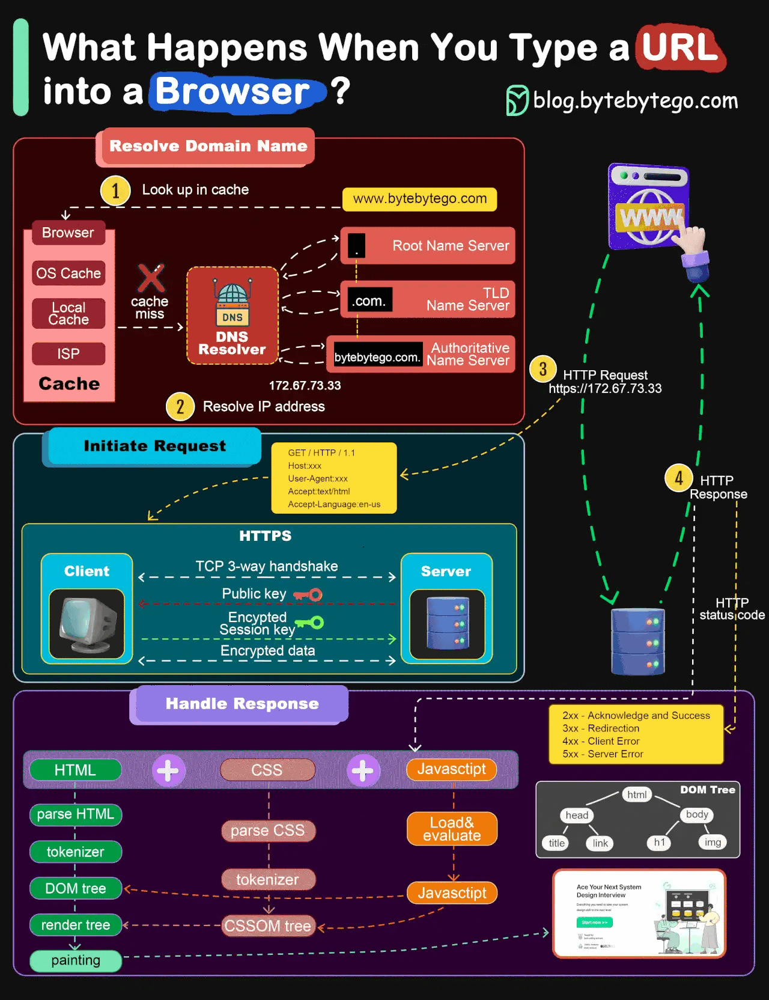

# Appunti del 16 Settembre 2025

## Argomenti anno precedente
- Git e GitHub
- HTML 
- CSS
- JavaScript
- Typescript
- React (solo introduzione)

### HTML
- COSA E' HTML
    - HyperText Markup Language [(HTML)](./definizioni/semantica.md "Definizione di HTML")
    - Linguaggio di markup per la creazione di pagine web
    - Può essere assistito da CSS (stile) e JavaScript (funzionalità)
    - Struttura di una pagina web tramite elementi (tag)

- ELEMENTI E TAG
    - Ogni tag ha una funzione specifica e non può essere usato in modo arbitrario [(semantica)](./definizioni/semantica.md "Definizione di semantica")
    - Un elemento HTML è composto da:
        - Una tag di apertura: `<tagname>`
        - Il contenuto dell'elemento
        - Una tag di chiusura: `</tagname>`
        - Esempio: `<p>Il mio primo paragrafo.</p>`
    - Tag vuoti:
        - Non hanno tag di chiusura
        - Esempi: ``, `<br>`, `<hr>`, `<input>`
        - Esempio: ``

- ATTRIBUTI
    - Forniscono informazioni aggiuntive sugli elementi
    - Sono specificati nella tag di apertura
    - Hanno la forma nome="valore"
    - Esempio: ``

- STRUTTURA DI UN DOCUMENTO HTML [(sintassi)](./definizioni/semantica.md "Definizione di sintassi")
    - È una struttura ad albero (gerarchica)
    - `<!DOCTYPE html>`: Dichiara il tipo di documento
    - `<html lang="it">`: Elemento radice della pagina, con attributo per la lingua
    - `<head>`: Contiene metadati, collegamenti a risorse esterne (CSS, JS), titolo della pagina
    - `<body>`: Contiene il contenuto visibile della pagina
    - `<title>`: Definisce il titolo della pagina, visibile nella scheda del browser
    - `<meta>`: Fornisce metadati come charset, viewport, descrizione

### Cosa succede quando si digita un URL in un browser? 
1. Il browser invia una richiesta DNS per risolvere il nome di dominio in un indirizzo IP.
2. Una volta ottenuto l'indirizzo IP, il browser invia una richiesta HTTP al server web corrispondente. 
3. Il server web riceve la richiesta e risponde con il file HTML richiesto.
4. Il browser riceve il file HTML e inizia a interpretarlo, scaricando eventuali risorse esterne (CSS, JS, immagini) specificate nel file HTML.
5. Il browser rende la pagina web visibile all'utente.



### Tipi di elementi HTML

#### Elementi HTML comuni
- **Titoli**: `<h1>`, `<h2>`, `<h3>`, `<h4>`, `<h5>`, `<h6>`
- **Paragrafo**: `<p>`
- **Link**: `<a href="url">testo del link</a>`
- **Immagine**: ``
- **Liste**: `<ul>`, `<ol>`, `<li>`
- **Tabelle**: `<table>`, `<tr>`, `<td>`
- **Divisori**: `<div>`, `<span>`
- **Form**: `<form>`, `<input>`, `<button>`
- **Script e stili**: `<script>`, `<style>`, `<link>`
- **Struttura**: `<meta>`, `<title>`, `<head>`, `<body>`, `<html>`

#### Tag semantici
I tag semantici descrivono chiaramente il loro significato:
- `<header>`: intestazione di una pagina o di una sezione
- `<footer>`: piè di pagina
- `<nav>`: sezione di navigazione
- `<main>`: contenuto principale della pagina
- `<section>`: sezione generica
- `<article>`: contenuto indipendente
- `<aside>`: contenuto correlato ma separato
- `<figure>` e `<figcaption>`: immagini con didascalie

#### Tag multimediali
- `<audio>`, `<video>`, `<source>`: elementi audio e video
- `<canvas>`, `<svg>`: grafica
- `<iframe>`: incorporare contenuti esterni

#### Entity HTML
Le entity sono codici speciali per rappresentare caratteri riservati o speciali:
- `&lt;` per <
- `&gt;` per >
- `&amp;` per &
- `&quot;` per "
- `&copy;` per ©
- `&nbsp;` per uno spazio non separabile
- `&euro;` per €

### Esempio di documento HTML completo
```html
<!DOCTYPE html>
<html>
  <head>
    <title>Titolo della pagina</title>
  </head>
  <body>
    <h1>Il mio primo titolo</h1>
    <p>Il mio <strong>primo paragrafo.</strong></p>
  </body>
</html>
```

Questo esempio mostra la struttura gerarchica ad albero degli elementi HTML, con il corretto annidamento dei tag.

## CSS

### COSA È CSS
- Cascading Style Sheets [(CSS)](./definizioni/semantica.md#css "Definizione di CSS")
- Linguaggio di stile per la presentazione di documenti HTML
- Permette di separare il contenuto (HTML) dalla presentazione (CSS)
- Consente di controllare layout, colori, font, spaziature e altri aspetti visivi

### STRUTTURA DI UNA REGOLA CSS
- **Selettore**: indica a quali elementi HTML si applica la regola
- **Dichiarazione**: specifica quali proprietà di stile applicare
  - **Proprietà**: aspetto da modificare (es. color, font-size)
  - **Valore**: come modificare la proprietà (es. blue, 24px)

Esempio di regola CSS:
```css
h1 {
  color: blue;
  font-size: 24px;
}
```

In questo esempio:
- `h1` è il selettore (si applica a tutti gli elementi `<h1>`)
- `color: blue;` e `font-size: 24px;` sono le dichiarazioni
  - `color` e `font-size` sono le proprietà
  - `blue` e `24px` sono i valori

### METODI PER INCLUDERE CSS IN UN DOCUMENTO HTML

#### 1. CSS interno
Inserito all'interno del documento HTML usando il tag `<style>` nella sezione `<head>`:

```html
<!DOCTYPE html>
<html>
  <head>
    <style>
      h1 {
        color: blue;
        font-size: 24px;
      }
    </style>
  </head>
  <body>
    <h1>Il mio primo titolo</h1>
    <p>Il mio primo paragrafo.</p>
  </body>
</html>
```

#### 2. CSS esterno
Collegato al documento HTML tramite il tag `<link>` nella sezione `<head>`:

```html
<!DOCTYPE html>
<html>
  <head>
    <link rel="stylesheet" href="styles.css">
  </head>
  <body>
    <h1>Il mio primo titolo</h1>
    <p>Il mio primo paragrafo.</p>
  </body>
</html>
```

Il file `styles.css` conterrebbe:
```css
h1 {
  color: blue;
  font-size: 24px;
}
```

#### 3. CSS inline
Applicato direttamente a un elemento HTML tramite l'attributo `style`:

```html
<!DOCTYPE html>
<html>
  <head>
  </head>
  <body>
    <h1 style="color: blue; font-size: 24px;">Il mio primo titolo</h1>
    <p>Il mio primo paragrafo.</p>
  </body>
</html>
```

### TIPI DI SELETTORI CSS
- **Selettore di elemento**: seleziona tutti gli elementi di un tipo specifico (`h1`, `p`, `div`)
- **Selettore di classe**: seleziona elementi con una specifica classe (`.classe`)
- **Selettore di ID**: seleziona un elemento con uno specifico ID (`#id`)
- **Selettore di attributo**: seleziona elementi con un attributo specifico (`[attribute=value]`)
- **Selettori combinati**: combinano più selettori (es. `div.classe`)
- **Pseudo-classi**: selezionano stati specifici degli elementi (es. `:hover`, `:focus`)
- **Pseudo-elementi**: selezionano parti specifiche degli elementi (es. `::before`, `::after`)

### PROPRIETÀ CSS COMUNI
- **Testo**: `color`, `font-family`, `font-size`, `text-align`
- **Sfondo**: `background-color`, `background-image`
- **Bordi**: `border`, `border-radius`
- **Layout**: `width`, `height`, `margin`, `padding`
- **Posizionamento**: `position`, `display`, `float`
- **Flessibilità**: `flex`, `grid`
