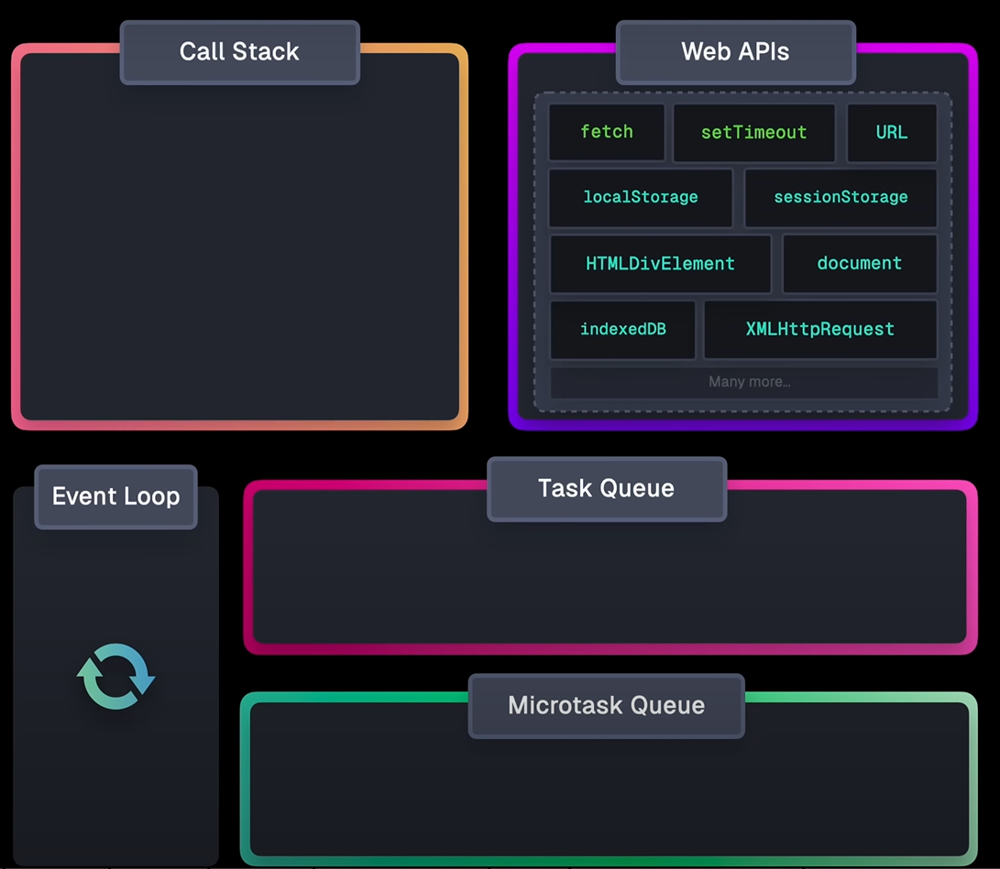

# Appunti del 30 Settembre 2025

## Argomenti di oggi
- JS Engine
- Da cosa è composto un JS Engine
- Programmazione Asincrona
- Concorrenza, Parallelismo e Asincronia

## JS Engine

Link per video: 
https://www.youtube.com/watch?v=eiC58R16hb8 

## Da cosa è composto un JS Engine
- Event Loop: gestisce l'esecuzione del codice, le callback e gli eventi
- Call Stack: struttura dati che tiene traccia delle funzioni attive
- Heap: area di memoria per l'allocazione dinamica
- Web APIs: API fornite dal browser (es. DOM, Fetch)
- Callback Queue: coda delle funzioni callback pronte per essere eseguite
- Microtask Queue: coda per le microtask (es. Promises)

## Esempio
- Come funziona setTimeout
```javascript   
console.log('Inizio');
setTimeout(() => {
    console.log('Timeout');
    }, 0);
console.log('Fine');
```

- Output:
```
Inizio
Fine
Timeout
```                      

Ogni chiamata di funzione crea un execution context che viene inserito nello stack. Quando la funzione termina, il contesto viene rimosso dallo stack.

Quindi, anche se `setTimeout` è impostato a 0 ms, la funzione callback viene messa nella Callback Queue e attende che lo stack sia vuoto prima di essere eseguita.
Poi viene spostata nella Microtask Queue se ci sono microtask in attesa, altrimenti viene eseguita direttamente dalla Callback Queue.
- La Microtask Queue ha priorità sulla Callback Queue, quindi le microtask vengono eseguite prima delle callback normali.
- Questo spiega perché "Timeout" viene stampato per ultimo, anche con un timeout di 0 ms.

---

## Programmazione Asincrona - La Strategia del "Non Aspettare"

### Concetto Fondamentale: Operazioni Non Bloccanti
La programmazione asincrona è un modello pensato per gestire compiti senza rimanere bloccati in attesa. Permette a un programma di avviare un'operazione lunga e, invece di aspettare che finisca, proseguire subito con altro lavoro. Questo si chiama **esecuzione non bloccante**. Quando l'operazione termina, il programma viene notificato (tramite un risultato o una callback).

**Analogia dell'officina:**  
Un approccio sincrono è come portare la macchina dal meccanico e aspettare in sala d'attesa finché non è pronta (sei bloccato). L'approccio asincrono è come lasciare la macchina e dare il tuo numero di telefono: sei libero di fare altro e vieni chiamato quando la macchina è pronta.


### Caso Ideale: Lavoro I/O-Bound
La programmazione asincrona è ideale per compiti I/O-bound (Input/Output), cioè operazioni che coinvolgono lettura/scrittura su disco, richieste di rete, database, ecc.  
La CPU è molto veloce rispetto alle operazioni I/O. In un modello sincrono, la CPU resta inattiva durante l'attesa. L'asincronia permette di sfruttare la CPU per altri compiti mentre l'I/O procede in background.

### Meccanismi dell'Asincronia
- **Callback:** Si passa una funzione all'operazione asincrona, che verrà eseguita al termine.
- **Promise/Future:** L'operazione restituisce un oggetto speciale che rappresenta il risultato futuro. Si può "agganciare" codice da eseguire quando il risultato sarà disponibile.
- **Async/Await:** Sintassi moderna che permette di scrivere codice asincrono in modo simile a quello sequenziale, facilitando la gestione di flussi complessi.

---

## Parte 6: Sintesi - Come Funzionano Insieme

### Asincronia come Modello di Concorrenza
La programmazione asincrona è una strategia per ottenere **concorrenza**. La concorrenza è l'obiettivo generale: gestire più compiti in modo sovrapposto. L'asincronia è uno strumento efficiente, soprattutto su un singolo thread.

Molti sistemi concorrenti (es. Node.js) sono single-threaded e usano un **event loop**: questo ciclo controlla costantemente se ci sono operazioni I/O completate e esegue il codice in attesa. È una forma di "context switching" cooperativo, molto efficiente per carichi I/O-bound.

---

### Tabella Comparativa: Concorrenza, Parallelismo, Asincronia

| Criterio         | Concorrenza                              | Parallelismo                           | Programmazione Asincrona                |
|------------------|------------------------------------------|----------------------------------------|-----------------------------------------|
| Idea principale  | Gestire molte cose contemporaneamente    | Fare molte cose contemporaneamente     | Non aspettare operazioni lente          |
| Obiettivo        | Responsività, gestione della complessità | Prestazioni, throughput elevato        | Efficienza CPU, responsività            |
| Meccanismo chiave| Context switching, interleaving          | Esecuzione simultanea su più core      | Chiamate non bloccanti, event loop      |
| Analogia         | Un giocoliere; un cassiere per due file  | Più chef; due cassieri per due file    | Lasciare l'auto e ricevere una chiamata |
| Hardware         | Basta un solo core                       | Servono più core                       | Basta un solo core                      |
| Ideale per...    | UI o applicazioni I/O-bound              | Calcoli intensivi, CPU-bound           | Task I/O-bound (rete, disco)            |
| Relazione        | Gestione generale di più compiti         | Esecuzione più veloce di programmi     | Modello per ottenere concorrenza        |

---

Questa sintesi ti aiuta a distinguere tra concetti chiave della programmazione moderna e a capire come l'asincronia si integra con la concorrenza e il parallelismo.
